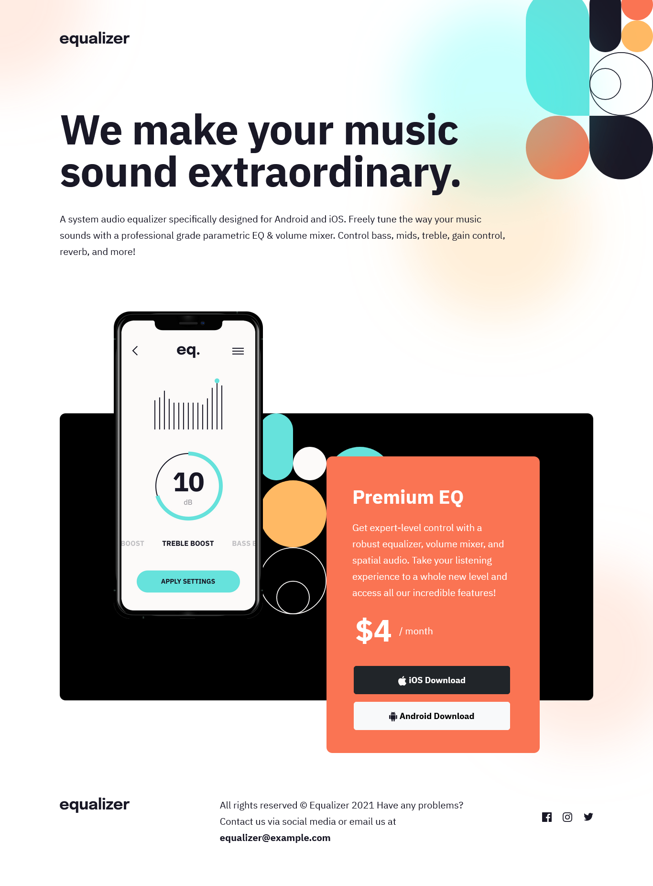

# Frontend Mentor - Equalizer landing page

## Welcome! 👋

This is a solution to the [Equalizer landing page challenge on Frontend Mentor](https://www.frontendmentor.io/challenges/equalizer-landing-page-7VJ4gp3DE). Frontend Mentor challenges help you improve your coding skills by building realistic projects.

## Table of contents

- [Overview](#overview)
  - [Screenshot](#screenshot)
  - [Links](#links)
- [My process](#my-process)
  - [Built with](#built-with)
  - [Useful resources](#useful-resources)
- [Author](#author)
- [Acknowledgments](#acknowledgments)

## Overview

This HTML & CSS-only challenge will be perfect for anyone starting to build responsive projects.

### Screenshot

### Links

- [Solution URL](https://www.frontendmentor.io/solutions/equalizer-landing-page-ndnCxvChyD)
- [Live Site URL](https://eyelin.github.io/Equalizer-landing-page/)

## My process

### Built with

- Semantic HTML5 markup
- CSS custom properties
- Mobile-first workflow
- Flexbox
- Bootstrap

### Useful resources

- [Figma](https://www.figma.com) - This is a powerful tool that helps developers to have better access to the designs and have the ability to extract information about typography, redlines, colors, measurement and more.
- [PerfectPixel](https://chrome.google.com/webstore/detail/perfectpixel-by-welldonec/dkaagdgjmgdmbnecmcefdhjekcoceebi) - Chrome extension that helps you to match the pixels of the provided design.
- [Pesticide](https://chrome.google.com/webstore/detail/pesticide-for-chrome/bakpbgckdnepkmkeaiomhmfcnejndkbi) - Chrome extension that inserts the Pesticide CSS into the current page, outlining each element to better see placement on the page.

## Author

- Frontend Mentor - [@Eyelin](https://www.frontendmentor.io/profile/eyelin)

## Acknowledgments

A big thank you to Frontend Mentor and the community!
